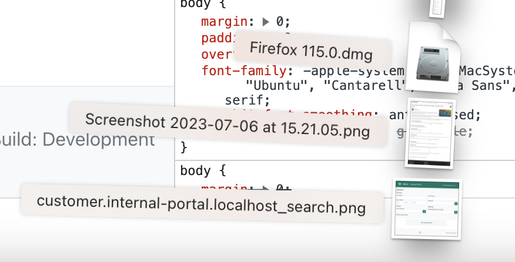

**TL:DR Capture full-length webpage screenshots using built in Developer Tools.**

Sometimes when developing a webpage you may need to send screenshots back and forth between members of your squad or business.

When doing this it is important that you capture the full webpage in order to really display what you're working on. Which is why introducing simple devtools may be of use.

In order to do this you will need to open your browser of choice and navigate to the page you would like to capture.

## Google Chrome
1. Once on the page you would like to capture you should firstly access Developer Tools by clicking `Cmd` + `Opt` + `I` *(on Mac)* or `Ctrl` + `Shift` + `I` *(on Windows)*


2. Then, press `Cmd` + `shift` + `P` *(on Mac)* or `Ctrl` + `Shift` + `P` *(on Windows)*.


3. In the search bar, immediately after the word Run >, type "screenshot".

  

4. Select Capture full size screenshot, and Chrome will automatically save a full-page screenshot to your Downloads folder as a png and it will generate the name based off the webpage's URL.


<p align="center"></p>

## Chaos Engineering

Chaos engineering is a concept that has been around since the early 2000s. The idea is simple - can we build resilient, 
fault-tolerant services and how do we prove this? 

How does a service cope when it loses connection to a database?
What about a service that has gone down that our service depends on? 

To prove a system is resilient against these types of issues we might experiment and replicate these issues to monitor
the impact. Remove the database connection, terminate a dependent service etc. 

In general, cause chaos. So let's take that concept, and apply it to something like test data! 
 
## Introducing Chaos for FakerMaker

FakerMaker v2 introduces chaos mode.

Let's explore the `some_fancy_object` example from earlier. This time with chaos enabled.

```ruby
FakerMaker.factory :some_fancy_object, naming: :json do
  some_required_attribute_1(required: true) { Faker::Lorem.sentence }
  some_required_attribute_2(optional: false) { Faker::Lorem.word }
  some_optional_attribute_1 { Faker::Lorem.word }
  some_optional_attribute_2(optional: 90) { Faker::Lorem.word }
  some_optional_attribute_3(optional: 10) { Faker::Lorem.word }
end

FakerMaker[:some_fancy_object].build(chaos: true).as_json 
# => {"someRequiredAttribute1"=>"Sed rem magnam placeat.", "someRequiredAttribute2"=>"nemo", "someOptionalAttribute2"=>"dolores"}
FakerMaker[:some_fancy_object].build(chaos: true).as_json 
# => {"someRequiredAttribute1"=>"Hic neque aut sapiente.", "someRequiredAttribute2"=>"saepe", "someOptionalAttribute1"=>"id"}
FakerMaker[:some_fancy_object].build(chaos: true).as_json 
# => {"someRequiredAttribute1"=>"Fuga est rerum quia.", "someRequiredAttribute2"=>"vero", "someOptionalAttribute2"=>"nulla", "someOptionalAttribute1"=>"dolorem"}
```

When a factory is built with chaos enabled, optional fields become truly optional and may not be present in the built factory. 

Not only is the data dynamic per attribute, but the attributes themselves are now dynamic ... chaos!

Lets dig in a bit ...

### Attribute metadata

Attributes can now be tagged as `required` or `optional`.

```ruby
some_required_attribute_1(required: true) { Faker::Lorem.sentence }
some_optional_attribute_1(optional: true) { Faker::Lorem.sentence }
```
> By default, all attributes are `optional`.

You can also pass through an optional weighting. This determines the likelihood of that attribute appearing in your built factory

```ruby
some_optional_attribute_1(optional: 90) { Faker::Lorem.sentence } # 90% chance this attribute will be present
some_optional_attribute_2(optional: 10) { Faker::Lorem.sentence } # 10% chance this attribute will be present
```
> By default, all `optional` attributes are weighted at `50%`.

Metadata on attributes provides some benefits without chaos enabled. 

Factories are often modelling schemas listed in API contracts. These contracts state which fields are required. 

By having this data available on the factory it gives us at a glance information at the data we are modeling without 
the hassle of checking API contracts.

### Enabling Chaos

Chaos is enabled when a factory object is built by passing the `chaos` flag.

```ruby
FakerMaker[:some_fancy_object].build(chaos: true)
```

You can also specify which fields to run chaos over by passing an `Array`.

```ruby
FakerMaker[:some_fancy_object].build(chaos: %i[some_optional_attribute_1])
```
> Chaos will only run on `some_optional_attribute_1` and not against the other optional attributes.


### Why would I want this?

By using this approach to testing, we are more closely mimicking real life scenarios. 

Data comes in all shapes and sizes, especially when optional attributes come into play. 

How do you know an APIs optional field is truly optional? How do you know your beautiful webpage that displays data with optional fields will actually work?

Chaos introduces new combinations of tests without the hassle or mess of doing it yourself.

### TL:DR
- Every attribute is `optional` by default
- Optional attributes maybe removed when your factory is built and chaos is enabled
- Attributes can be marked as `required` - required attributes will always be present
- You can add weighting to individual optional attributes to determine the likelihood of them being present
- You can run chaos over a subset of optional attributes when building your factory

---
